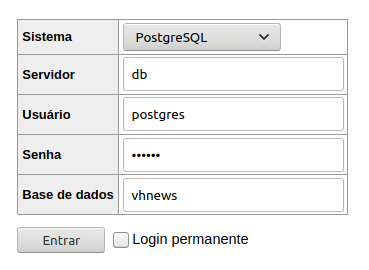

# VHNews

Trabalho desenvolvido para a disciplina de fundamentos de bancos de dados, para o curso de engenharia de computação - UFRGS.

## Como rodar

```
docker-compose up
```

após isso, deve existir uma instancia do banco postgres rodando na sua máquina, um client adminer disponível em [localhost:8080](localhost:8080) e uma aplicação web rodando em [localhost:8000](localhost:8000).

### Acesso via adminer


#### senha default: mypass
pode ser alterada no arquivo docker-compose.yml

### Instalação docker e docker-compose em Debian

```bash
sudo apt install docker.io docker-compose
# start docker 
sudo systemctl start docker
```